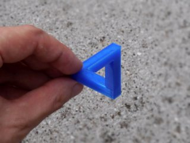
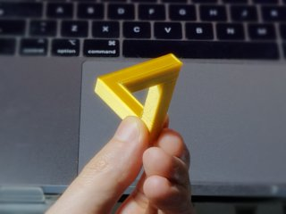
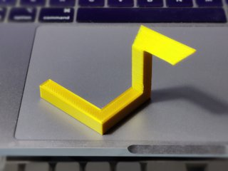

# Paradox Illusions - Penrose triangle optimised
*3D printable Penrose triangle illusion with minimal structure (formerly thing:1685223)*

### License
[Creative Commons - Attribution](https://creativecommons.org/licenses/by/4.0/)

### Attribution
This is a remix of Tomonori's Paradox Illusions Design - Penrose triangle ([Thingiverse thing:547580](https://www.thingiverse.com/thing:547580)).

### Gallery

[🔎](images/photo1.jpg) [🔎](images/photo2.jpg) [🔎](images/photo3.jpg)

## Description and Instructions

This is a remix of Tomonori's Penrose triangle. The changes are:

* Parts that are hidden anyway when viewing from the correct angle to see the illusion, have been removed. This means a quicker print, less material, and a more puzzling shape (it isn't obvious how this could represent a triangle when not viewed from the right angle).
* Default size scaled to 75%.
* Offered in 3 versions: one to be viewed from a short distance (about the same as the original), one from a farther distance, and one from an even farther distance. Use the far versions for smaller prints, and the near version for larger prints.
* Nearly all of the slanted overhangs have been exchanged for one obvious horizontal overhang that will require support material. I generally avoid the need for overhangs, but in this case it does make the print less difficult.

The illusion only really works when viewing with one eye closed (or if you're a pirate). It works best on photographs or videos.

### Print Settings I've used

Supports are required. I have provided a model with a built-in support for each of the variants. This is likely the most optimal support, but maybe you'll want to trust your slicer's own support generator instead.

The other print settings are less crucial. I printed this at 0.2 mm layers with 15% infill.

## Updates

### 2016/07/22
First published on Thingiverse.

### 2022/08/23
Migrated to GitHub. Added ‘farther’ model and provided models with built-in supports.

## Tags
`escher`, `illusion`, `optical_illusion`, `paradox`, `penrose`, `triangle`
